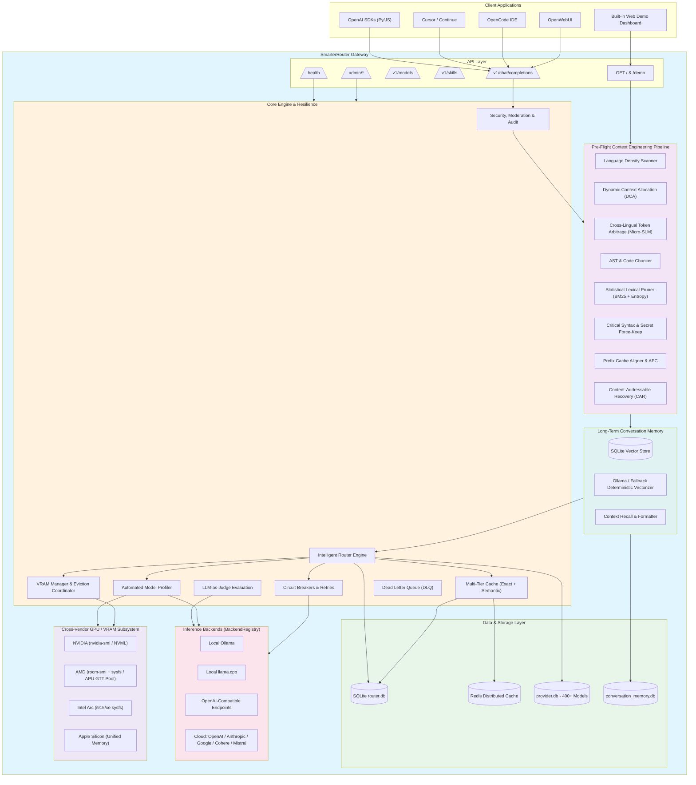
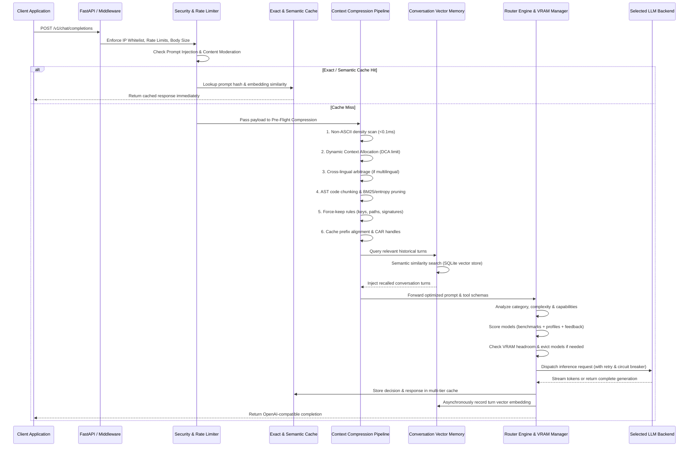
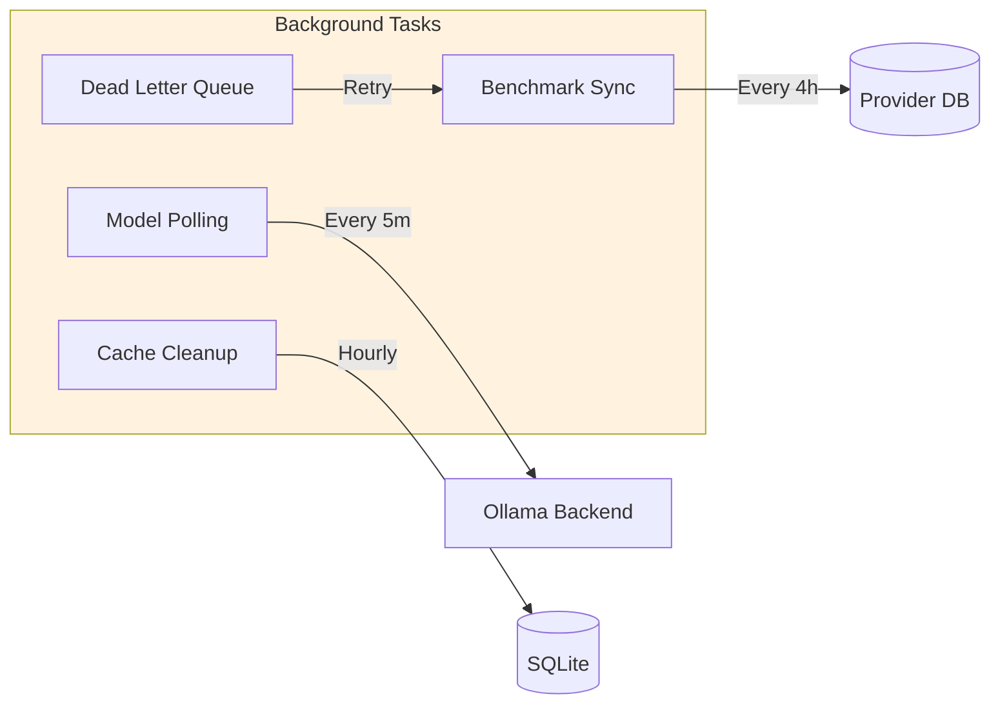
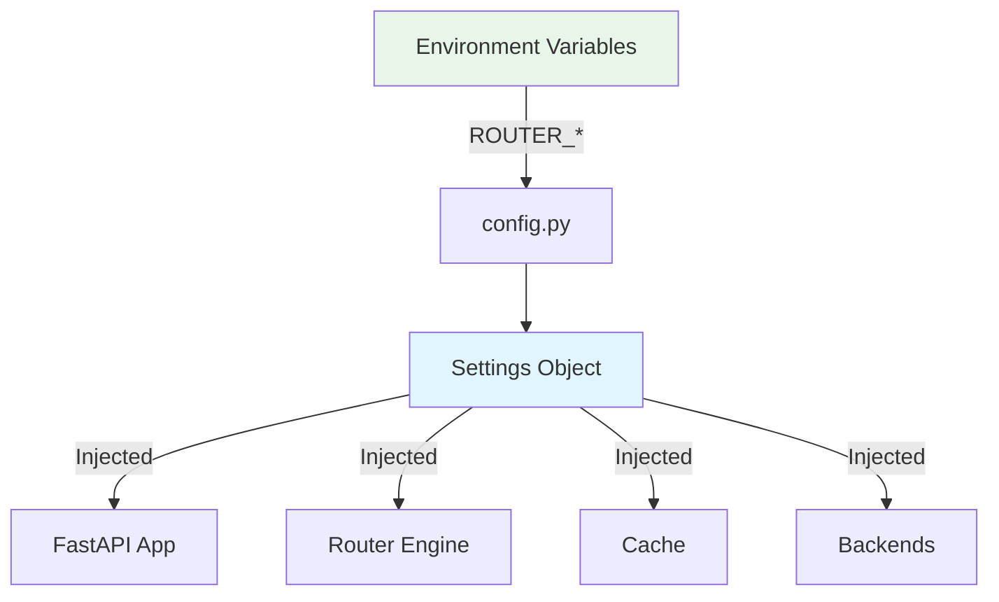
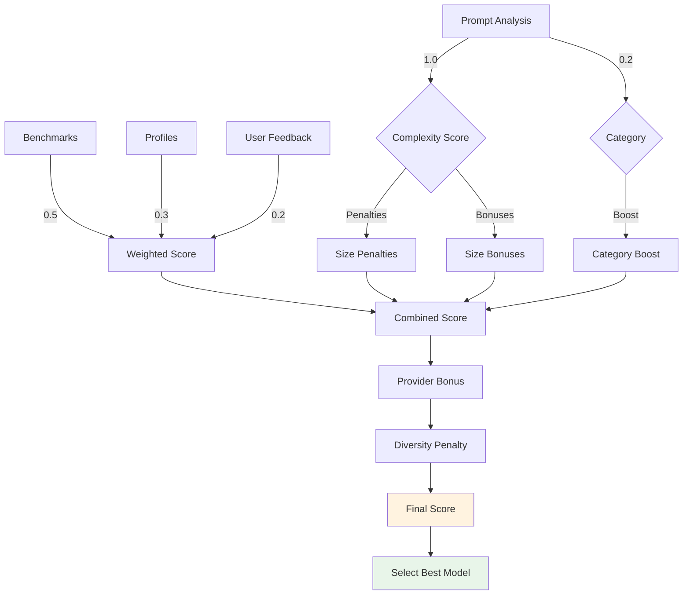
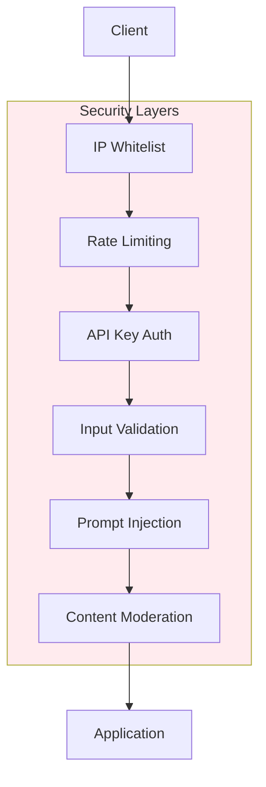
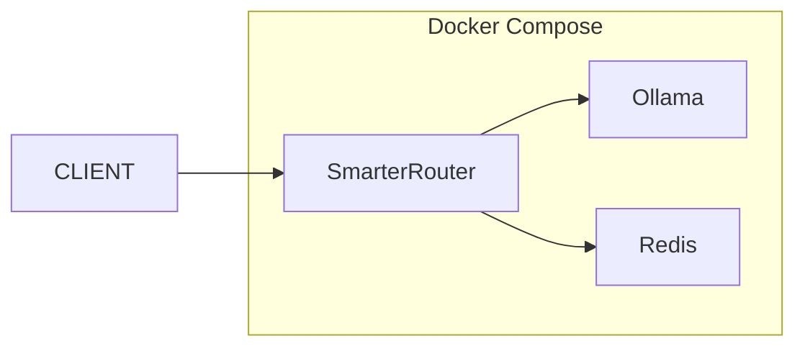
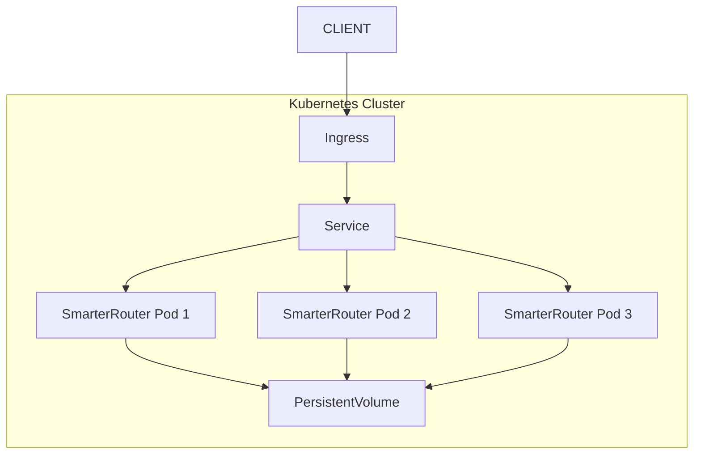

# Architecture Overview

This document describes the SmarterRouter architecture, data flows, pre-flight context engineering, and execution layers.

## System Architecture



## Request Flow



## Component Breakdown

### 1. API Layer

- **REST API**: High-concurrency FastAPI gateway supporting `/v1/chat/completions`, `/v1/models`, `/v1/embeddings`, `/v1/feedback`, and `/v1/skills`.
- **Interactive Web Demo UI**: Mounted at `GET /` and `GET /demo` providing real-time hardware telemetry and live before/after prompt compression inspections.
- **Admin Control Plane**: Protected `/admin/*` management suite for profiling, cache invalidation, DLQ retries, benchmark syncing, and audit logs.

### 2. Pre-Flight Dynamic Context Compression Pipeline

Operates before model dispatch to solve the "100:1 agentic payload problem":
- **Language Density Scanner (`scanner.py`)**: Sub-millisecond ASCII/Unicode ratio calculation. English prompts bypass translation SLMs entirely with zero latency.
- **Dynamic Context-Window Allocation (`dca.py`)**: Partitions token budgets with hysteresis dampening to prevent context thrashing.
- **Cross-Lingual Token Arbitrage (`arbitrage.py`)**: Compacts multilingual prompts via micro-SLMs into information-dense representations.
- **AST & Code Chunker (`chunker.py`)**: Lexical segmenter that respects programming language grammar, imports, and indentation.
- **Statistical Lexical Pruner (`statistical.py`)**: Composite scorer combining BM25, query overlap, position bias, entropy, and filler word filtering.
- **Critical Syntax & Secret Force-Keep (`force_keep.py`)**: Hard gate preserving API tokens, paths, URLs, and code signatures.
- **Prefix Cache Aligner & CAR (`cache_aligner.py`, `car.py`)**: Aligns static prompt prefixes and tool definitions for KV cache hit rates (RadixAttention/APC safe) with Content-Addressable Recovery handles.

### 3. Persistent Vector Long-Term Memory

- **`LocalVectorStore` (`router/memory/vector_store.py`)**: Embedded SQLite vector storage supporting cosine similarity matching and metadata filtering.
- **`ConversationMemoryManager` (`router/memory/memory_manager.py`)**: Ingests user and assistant turns, generates embeddings via Ollama or deterministic sub-millisecond hash vectorizer fallback, and formats relevant memory blocks into incoming prompt context.

### 4. Router Engine & VRAM Manager

- **Task Classification**: Analyzes prompts for task category (coding, reasoning, creativity, factual) and complexity.
- **Capability Detection**: Automatically identifies vision, function/tool calling, or embedding needs.
- **Multi-Factor Scoring**: Evaluates local runtime profiles, global benchmarks (provider.db), and historical user feedback tuned by `ROUTER_QUALITY_PREFERENCE`.
- **VRAM Headroom Allocator (`vram_manager.py`)**: Prevents out-of-memory errors by monitoring live GPU allocations and evicting inactive models (LRU or largest-first), respecting pinned models.

### 5. Backend Abstraction & Resilience

- **`BackendRegistry`**: Unified router dispatching across Ollama, llama.cpp, and external cloud APIs (OpenAI, Anthropic, Google Gemini, Cohere, Mistral).
- **Circuit Breaker Pattern (`circuit_breaker.py`)**: Fails fast during backend outages and probes recovery in half-open state.
- **Transient Retry Layer (`retry.py`)**: Exponential backoff for HTTP 429, 5xx, and network timeouts.
- **Dead Letter Queue (`dlq.py`)**: Persists failed asynchronous background tasks for inspection and manual/automatic retry.

### 6. GPU Monitoring Subsystem

Auto-detects active hardware on startup:
- **NVIDIA**: `nvidia-smi` and pyNVML per-GPU telemetry.
- **AMD / ROCm**: `rocm-smi` and sysfs memory tracking, including APU unified memory (GTT pool detection).
- **Intel**: sysfs monitoring for Arc / Xe GPUs (`lmem_total`).
- **Apple Silicon**: Unified memory detection (default: 75% of system RAM).

## Data Flow Detail

### Chat Completion Request

1. **Request Validation**
   - Parse JSON body, check request size limits (`ROUTER_MAX_REQUEST_BODY_BYTES`, `ROUTER_MAX_MESSAGE_CONTENT_LENGTH`).
   - Validate model alias and rate limits.

2. **Security & Moderation**
   - Prompt injection analysis (`log`, `warn`, or `block`).
   - Content moderation category screening.

3. **Multi-Tier Cache Inspection**
   - Check exact SHA-256 routing and response cache.
   - Check semantic similarity cache (cosine similarity via numpy).

4. **Pre-Flight Context Compression**
   - Run Language Scanner, DCA budget allocation, AST chunker, statistical pruner, and prefix cache alignment.

5. **Conversation Memory Retrieval**
   - Query `conversation_memory.db` for semantically relevant historical turns and inject context.

6. **Model Selection & VRAM Check**
   - Query model profiles and benchmarks.
   - Calculate capability, speed, and quality scores.
   - Verify VRAM budget and trigger automated model eviction if over threshold.

7. **Backend Dispatch & Streaming**
   - Dispatch through Circuit Breaker and Retry middleware.
   - Stream SSE chunks or return full JSON response.

8. **Post-Processing & Asynchronous Storage**
   - Append model signature (`ROUTER_SIGNATURE_ENABLED`).
   - Store response in cache.
   - Record turn in persistent vector memory.
   - Record admin audit trail.


### Background Tasks



## Configuration Flow



## Scoring Algorithm



## Scalability Considerations

### Horizontal Scaling

- Stateless design enables multiple instances
- Redis backend for distributed caching
- Database connection pooling
- Load balancer distributes requests

### Performance Optimizations

- Async/await throughout
- Connection pooling for HTTP clients
- Batched database operations
- Vectorized similarity calculations (numpy)
- LRU caching for profiles and benchmarks

### Resource Management

- Automatic VRAM monitoring
- Circuit breakers prevent cascading failures
- Rate limiting protects resources
- Background tasks don't block requests

## Security Architecture



## Deployment Options

### Docker Compose (Single Node)



### Kubernetes (Production)



See [kubernetes.md](kubernetes.md) for detailed Kubernetes deployment instructions.

## Monitoring & Observability

### Metrics

- Request rate, latency, errors (RED metrics)
- Cache hit/miss rates
- GPU VRAM utilization
- Model selection distribution
- Backend health status

### Logging

- Structured JSON logging
- Request correlation IDs
- Sanitized user input
- Error context enrichment

### Health Checks

```
GET /health
```

Returns:
- Database connectivity
- Backend status
- GPU status
- Cache status
- Background task counts
- DLQ counts (if enabled)
